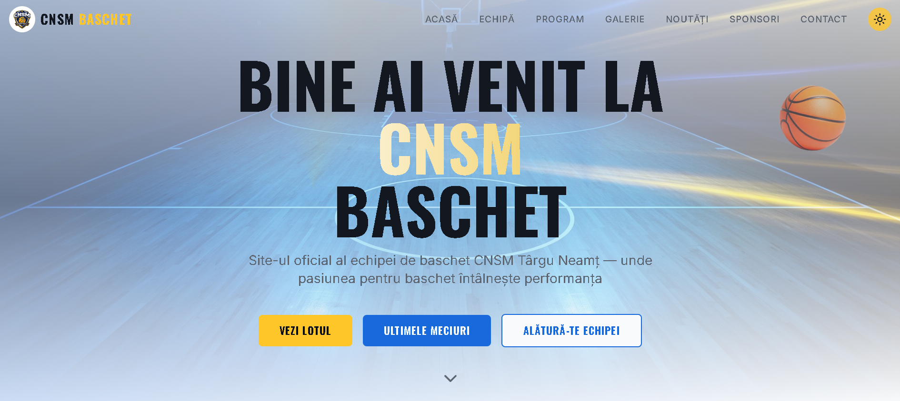

# 🏀 CNSM Basketball - Official Website

[](https://opensource.org/licenses/MIT)
[](https://www.typescriptlang.org/)
[](https://react.dev/)
[](https://vitejs.dev/)

> 🏀 The official website of CNSM Basketball team. View the schedule, players, results, news and more.

## 📸 Preview



## Overview

CNSM Basketball is the official website of the basketball team, built with modern web technologies to provide fans with a modern and responsive experience. The site includes information about players, coaches, game schedule, photo/video gallery, news and team sponsors.

## 🛠️ Technologies

- **🎨 Frontend Framework**: [React](https://react.dev/) 18.3
- **📘 Language**: [TypeScript](https://www.typescriptlang.org/) 5.8
- **⚡ Build Tool**: [Vite](https://vitejs.dev/) 5.4
- **🎭 Styling**: [Tailwind CSS](https://tailwindcss.com/) 3.4 + [shadcn/ui](https://ui.shadcn.com/)
- **🔀 Routing**: [React Router DOM](https://reactrouter.com/) 6.30
- **📡 State Management**: [TanStack Query](https://tanstack.com/query) 5.83
- **✨ Animations**: [Framer Motion](https://www.framer.com/motion/) 12.35
- **📝 Forms**: [React Hook Form](https://react-hook-form.com/) 7.61 + [Zod](https://zod.dev/)
- **🔗 Icons**: [Lucide React](https://lucide.dev/) 0.462
- **📊 Charts**: [Recharts](https://recharts.org/) 2.15

## 🚀 Getting Started

### 📋 Prerequisites

- [Node.js](https://nodejs.org/) (version 18+)
- [Bun](https://bun.sh/) (optional, alternative to npm)

### 🛠️ Installation

```bash
# Clone the repository
git clone <repository-url>
cd cnsmbasketball

# Install dependencies
npm install
# or if using Bun
bun install
```

### 💻 Development

```bash
# Start development server
npm run dev

# Run linter
npm run lint

# Run tests
npm run test
```

### 🔨 Build

```bash
# Build for production
npm run build

# Build for development
npm run build:dev

# Preview build
npm run preview
```

### 🚢 Deployment

```bash
# Deploy to GitHub Pages
npm run deploy
```

## 📁 Project Structure

```
cnsmbasketball/
├── src/
│   ├── assets/              # Static assets (images, video)
│   │   └── games/          # Match media
│   ├── components/         # React components
│   │   ├── ui/             # UI components (shadcn)
│   │   └── *.tsx           # Specific components
│   ├── hooks/              # Custom React hooks
│   ├── lib/                # Utilities
│   ├── pages/              # Main pages
│   ├── test/               # Tests
│   ├── App.tsx             # Main component
│   ├── main.tsx            # Entry point
│   └── index.css           # Global styles
├── public/                 # Public files
├── index.html              # Main HTML
├── package.json            # Dependencies and scripts
├── tailwind.config.ts      # Tailwind configuration
├── vite.config.ts          # Vite configuration
└── tsconfig.json          # TypeScript configuration
```

## 🛤️ Routes

| Route | Description |
|------|-------------|
| `/` | Home page |
| `/team` | Team page |
| `/players` | Players list |
| `/player/:id` | Player details |
| `/schedule` | Game schedule |
| `/gallery` | Photo/video gallery |
| `/news` | News |
| `/sponsors` | Sponsors |
| `/contact` | Contact |
| `/coach/:id` | Coach details |

## ✨ Features

- 🌙 Dark/Light Mode toggle
- 📱 Responsive design (mobile-first)
- 🎬 Media gallery with video and photos
- 📊 Statistics and results
- 🏆 Achievements section
- 📰 News system
- 👥 Pages for players and coaches
- 🎨 Smooth animations with Framer Motion

## 🤝 Contributing

1. Fork the repository
2. Create a new branch (`git checkout -b feature/new-feature`)
3. Commit your changes (`git commit -m 'Add new feature'`)
4. Push to the branch (`git push origin feature/new-feature`)
5. Open a Pull Request

## 📜 License

This project is licensed under the MIT License - see the [LICENSE](LICENSE) file for details.

## 📬 Contact

- **Email**: contact@cnsmbaschet.ro
- **Website**: www.cnsmbaschet.ro
- **Social Media**: [Facebook](https://facebook.com/cnsmbaschet) | [Instagram](https://instagram.com/cnsmbaschet)

---

⭐ Made with ❤️ by CNSM Basketball
